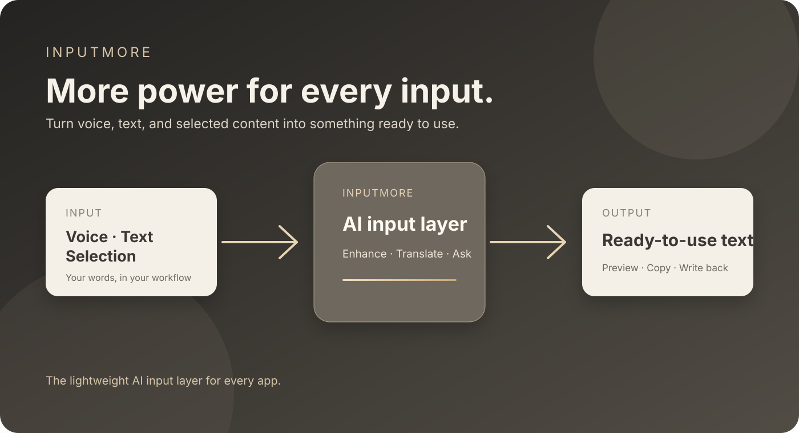

<div align="center">
  
  <h1>InputMore</h1>
  <p><strong>More power for every input.</strong></p>
  <p>The lightweight AI input layer for every app.</p>
  <p><a href="README.zh-CN.md">中文</a> · <a href="docs/getting-started.md">Quick start</a> · <a href="docs/product-status-and-roadmap.md">Roadmap</a> · <a href="CONTRIBUTING.md">Contributing</a></p>
</div>


InputMore helps you turn voice, text, and selected content into something ready to use in the app you already have open. Voice typing and text enhancement are the core experience; translation and occasional web answers are supporting tools.

> **Status:** early Windows release. The project is open source and actively evolving.

## Why InputMore?

Typing is often the slowest part of expressing a thought. InputMore stays close to your current workflow: trigger it with a shortcut, speak or provide text, then keep the result as a preview, copy it, or write it back to the active app.

- **Input enhancement first** — turn rough speech or text into clear, usable text.
- **Works across apps** — write back to the active Windows input position when the flow supports it.
- **Small and keyboard-first** — a floating capsule instead of another full chat window.
- **Provider-agnostic** — configure compatible ASR and LLM providers instead of being locked to one vendor.
- **Explicit by design** — retrieval results stay in the preview until you choose to copy them.

## What it can do

| Action | Input | Result |
| --- | --- | --- |
| Raw Write | Voice | Transcribe and write the original text back |
| Enhance | Text or selected text | Polish, punctuate, and keep the original meaning |
| Translate | Text | Preview a translation in a chosen language |
| Ask | A question | Show an answer and source links for occasional lookup |

## Quick start

1. Download a Windows build from [Releases](../../releases) when a packaged release is published, or run from source using the [Getting started](docs/getting-started.md) guide.
2. Open **Settings** and configure an ASR provider.
3. Configure an OpenAI-compatible text model for enhancement, translation, or Ask.
4. Focus any text field and press **Right Alt** to record; press it again to stop and write the transcription.
5. Select text and press **Ctrl + Right Alt** to enhance the selection.

For development setup, provider configuration, permissions, and troubleshooting, see [Getting started](docs/getting-started.md).



## Privacy and data flow

InputMore does not provide its own hosted AI service. Audio, text, and questions are sent only to the provider configured by you for the action you start. API keys are stored locally and must never be committed or included in bug reports. Retrieval answers are shown in the floating window and are not inserted automatically.

See [Privacy and data flow](docs/privacy.md) for the current boundaries.

## Architecture

```text
Voice / text / selection -> ASR, enhancement, translation, or retrieval
                         -> preview / copy
                         -> write back to the active app (supported flows)
```

The code is organized as domain/state, application flows, capabilities, infrastructure, and presentation. See [Architecture](docs/architecture.md).

## Roadmap

Current scope and planned work live in [Product status and roadmap](docs/product-status-and-roadmap.md). Cross-platform adapters, more search providers, local models, and streaming are future work—not current promises.

## Contributing

Bug reports, feature ideas, documentation improvements, and provider adapters are welcome. Please read [Contributing](CONTRIBUTING.md) and use the issue templates before opening a pull request.

## License

InputMore is released under the [MIT License](LICENSE).
