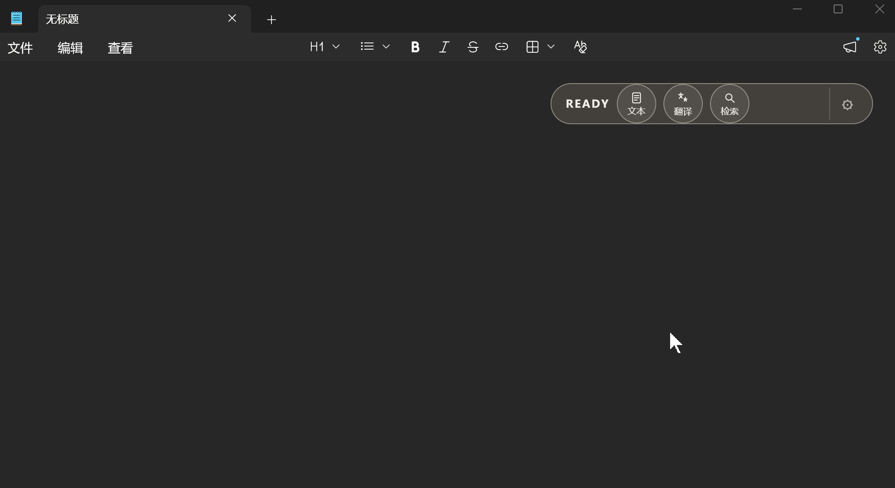

# InputMore

> **More power for every input.**
>
> **让每一次输入都拥有更多可能。**

InputMore 是一个轻量的桌面 AI 输入增强层：把语音、文本或选中文字处理成可以直接使用的内容。语音输入和文本整理是核心能力，翻译和偶尔的信息检索是辅助能力。

> **当前状态：** Windows 早期版本，项目开源并持续迭代。

## 核心能力

| 能力 | 输入 | 输出 |
| --- | --- | --- |
| 原文写回 | 语音 | 转写后写回当前应用 |
| 输入增强 | 文本或选中文字 | 润色、补充标点并保留原意 |
| 翻译 | 文本 | 预览指定语言的翻译结果 |
| 偶尔检索 | 问题 | 展示答案和来源链接 |

## 快速开始

1. 发布安装包后从 [GitHub Releases](../../releases) 下载；当前也可以按[首次使用指南](docs/getting-started.md)从源码运行；
2. 打开设置，配置语音识别 Provider；
3. 如需整理、翻译或检索，再配置 OpenAI-compatible 文本模型；
4. 在任意输入框按 **右 Alt** 开始录音，再按一次结束并写回；
5. 选中文字后按 **Ctrl + 右 Alt** 进行整理。

详细说明见 [首次使用指南](docs/getting-started.md)。

本地生成 Windows 安装包：运行 `npm run tauri build`，NSIS 安装包会生成在 `src-tauri/target/release/bundle/nsis/`。

## 实际效果

浮窗保持在当前工作流旁边，语音输入完成后可以继续预览、复制或写回当前应用。

## 隐私边界

InputMore 不提供自有托管 AI 服务。音频、文本和问题只会发送到你为对应功能配置的 Provider。API Key 保存在本机，不应提交到仓库或发到公开 Issue。检索结果默认只在浮窗中展示，不会自动写回输入框。

详见[隐私与数据流](docs/privacy.md)。

## 项目文档

- [English README](README.md)
- [产品状态与路线图](docs/product-status-and-roadmap.md)
- [架构说明](docs/architecture.md)
- [贡献指南](CONTRIBUTING.md)
- [安全策略](SECURITY.md)

## License

InputMore 使用 [MIT License](LICENSE) 发布。
